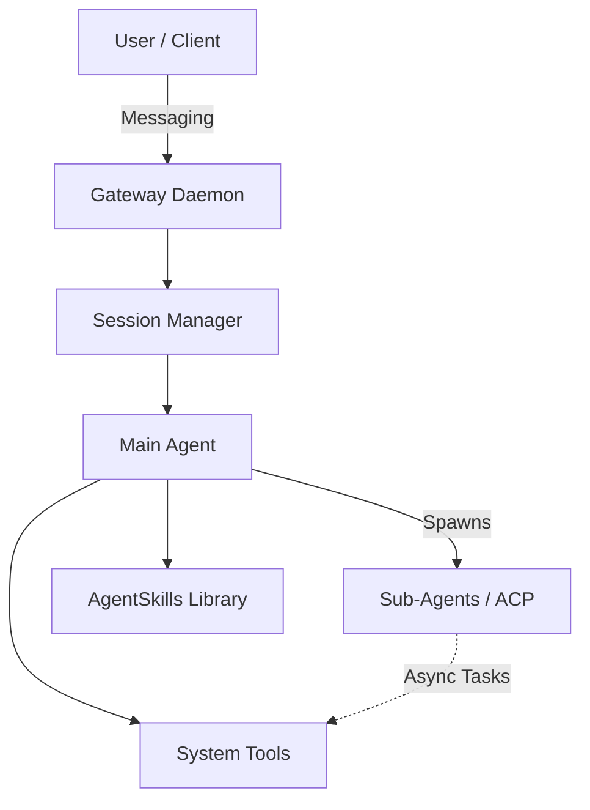

# OpenClaw Initialization Guide

Welcome to the **OpenClaw Setup Repository**. Since you're a seasoned developer with an extensive background in AI and software engineering, this guide gets straight to the core mechanics of how OpenClaw operates and what you need to configure to make it yours.

## 🧠 Architecture Overview

OpenClaw is an agentic framework designed for persistent, deeply integrated workflows rather than simple chat completions. It operates primarily through a local daemon (`gateway`) running in a node-based architecture.

### Core Concepts

1. **Persistent Memory (`MEMORY.md` & `memory/*.md`)**: OpenClaw retains state across sessions by writing to disk. The agent parses its workspace daily and synthesizes notes, retaining facts (e.g., your organizational constraints).
2. **Agent Skills (`/app/skills`)**: Tools are scoped dynamically via `SKILL.md` manifests. The agent reads these to understand how to execute custom CLI tooling, interact with APIs, or drive browser automation.
3. **Sub-agents (`sessions_spawn`)**: For long-running, complex, or isolated tasks (like sweeping a repo or crawling documentation), the main session can spawn ephemeral background agents (ACP threads or sub-agents) to operate asynchronously.
4. **Heartbeats (`HEARTBEAT.md`)**: A mechanism for proactive agentic behavior. By populating `HEARTBEAT.md`, you allow OpenClaw to poll external systems (like Slack, GitHub, or emails) periodically without direct prompts.

## 🚀 Getting Started

Check out `TODO.md` for a comprehensive checklist of what to set up next. The `templates/` directory contains scaffolding for your `SOUL.md`, `USER.md`, and `IDENTITY.md` configuration files.
